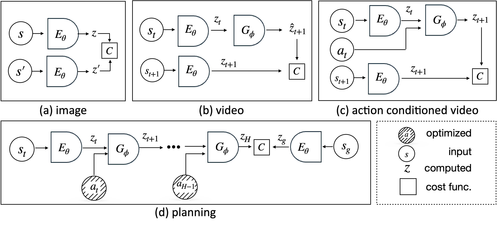

# Energy Based Joint Embedding Predictive Architectures


An open source library and tutorial aimed at learning representations for prediction and planning using joint embedding predictive arhictectures.
Examples include learning image (a), video (b), and action conidtioned video (c) predictive models representations, as well as planning with them (d).

Each example is (almost) self-contained and training takes up to few hours on a single GPU card.

### [Image Representations](examples/image_jepa/README.md)

This example demonstrates learning self-supervised representations from unlabeled images on CIFAR 10, and evaluated on image classification.


### [Predictive Video Representations](examples/video_jepa/README.md)


A model is trained to predict the next image representation in a sequence

### [Action Conditioned Prediction and Planning](examples/ac_video_jepa/README.md)

This example demonstrates a Joint Embedding Predictive Architecture (JEPA) for action-conditioned world modeling in the Two Rooms environment. The model learns to predict future states based on current observations and actions. These representations enable planning towards a goal observation embedding.

| Planning Episode | Task Definition |
|------------------|-----------------|
|  |  |
| *Successful planning episode* | *Episode task definition: from init to goal state* |

## Installation

We use [uv](https://docs.astral.sh/uv/guides/projects/) package manager to install and maintain packages. Once you have [installed uv](pip install --upgrade uv/), run the following to create a new virtual environment.

```bash
uv sync
```

This will create a virtual environment within the project folder at `.venv/`. To activate this environment, run `source .venv/bin/activate`.

Alternatively, if you don't want to run activate everytime, you can just prepend `uv run` before your python scripts:

```bash
uv run python main.py
```

## Running test cases

Libraries added to eb-jepa [must have their own test cases](/tests/). To run the tests: `uv run pytest tests/`

## Development

- The uv package comes with `black` and `isort`, which must be run before adding any file in this repo. The continous integration will check the linting of the PRs and new files.
- Every PR should be reviewed by folks tagged at [CODEOWNERS](docs/CODEOWNERS).


## License
EB JEPA is Apache licensed, as found in the [LICENSE](LICENSE.md) file.
